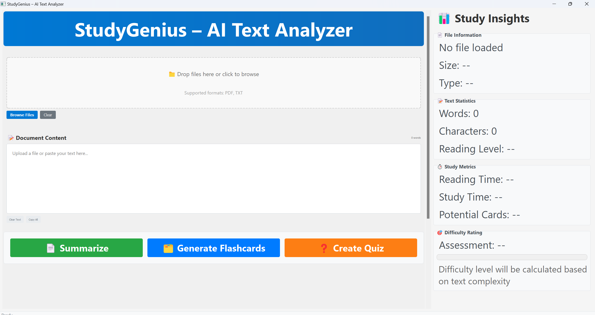
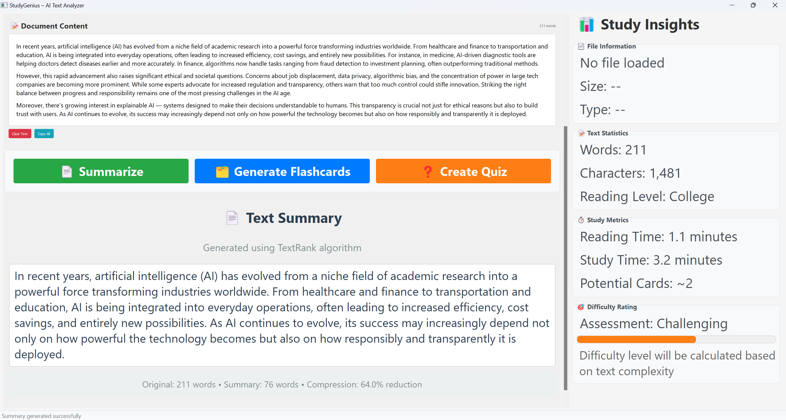
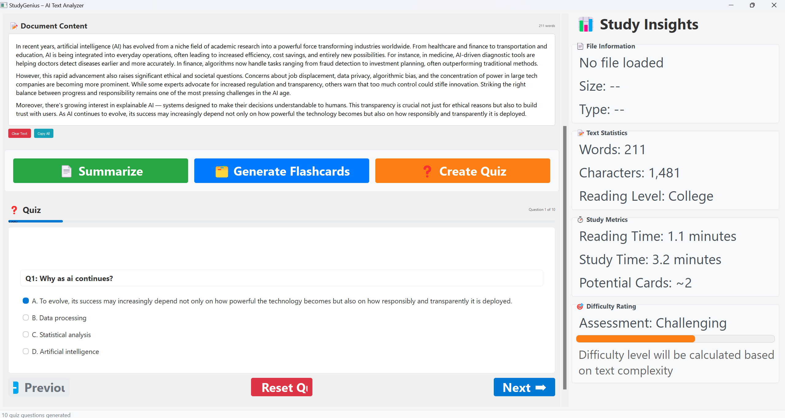
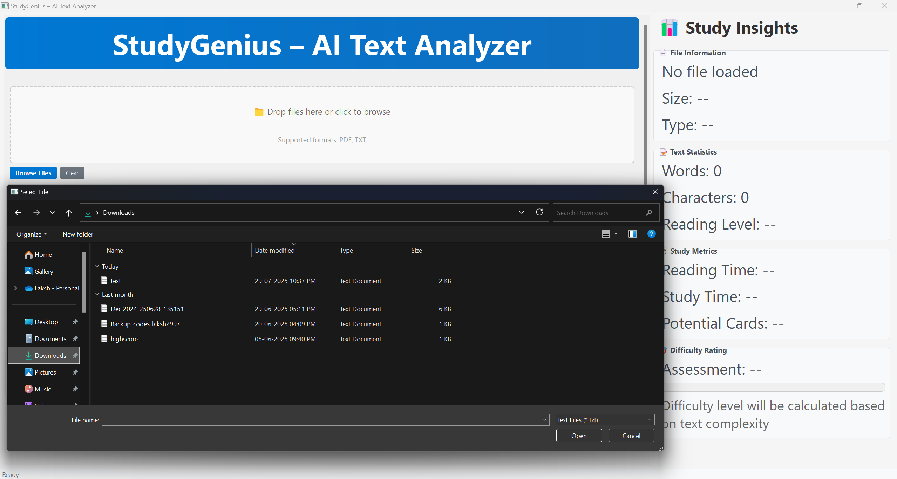

# StudyGenius - AI-Powered Study Tool

An intelligent study assistant that transforms text documents into interactive learning materials including summaries, flashcards, and quizzes using advanced NLP techniques.

## Features

### 📄 **Text Processing**

- **Multi-format Support**: PDF, TXT file processing
- **Intelligent Text Extraction**: Clean text extraction with preprocessing
- **Text Statistics**: Word count, character count, reading level analysis

### 📝 **Smart Summarization**

- **Multiple Algorithms**: LSA, TextRank, Luhn, LexRank, Edmundson
- **Auto-Selection**: Intelligent algorithm selection based on content
- **Customizable Length**: Adjustable summary ratio and sentence count

### 🗂️ **Flashcard Generation**

- **Question-Answer Pairs**: Automatic Q&A generation from text
- **Keyword-Definition Cards**: Extract key terms and definitions
- **Fill-in-the-Blank**: Intelligent word selection for blanks
- **Multiple Question Types**: What, How, Why, When, Where questions

### ❓ **Quiz Creation**

- **Auto-Generated Questions**: Multiple question types from text analysis
- **True/False Questions**: Automatic statement modification
- **Fill-in-the-Blank**: Context-aware word selection
- **Comprehensive Coverage**: Extract key concepts for assessment

### 🎯 **Study Analytics**

- **Reading Time Estimation**: Calculate study time requirements
- **Difficulty Assessment**: Content complexity analysis
- **Progress Tracking**: Study metrics and insights
- **File Information**: Detailed document statistics

## Screenshots

### Main Interface


_StudyGenius main dashboard with all features accessible_

### Text Summarization


_AI-powered text summarization with multiple algorithm options_

### Flashcard Generation


_Automatic flashcard creation from uploaded documents_

### Interactive Quiz


_Auto-generated quizzes for effective learning assessment_

### File Upload


_Simple drag-and-drop file upload interface_

## Installation

### Prerequisites

- Python 3.8 or higher
- pip package manager

### Setup Instructions

1. **Clone the repository**

   ```bash
   git clone <repository-url>
   cd StudyGenius
   ```

2. **Create virtual environment** (recommended)

   ```bash
   python -m venv venv
   source venv/bin/activate  # On Windows: venv\Scripts\activate
   ```

3. **Install dependencies**

   ```bash
   pip install -r requirements.txt
   ```

4. **Download NLTK data** (automatic on first run)
   ```python
   import nltk
   nltk.download('punkt')
   nltk.download('stopwords')
   ```

## Usage

### GUI Application

```bash
python main.py
```

### Command Line Usage

#### Text Summarization

```python
from src.summarizer import TextSummarizer

summarizer = TextSummarizer()
summary = summarizer.summarize_auto("Your text here...")
print(summary["summary"])
```

#### Generate Flashcards

```python
from src.flashCard import FlashCardGenerator

generator = FlashCardGenerator()
cards = generator.generate_flashcards("Your text here...", num_cards=10)
print(generator.format_flashcards(cards))
```

#### Create Quiz

```python
from src.quiz import QuizGenerator

generator = QuizGenerator()
quiz = generator.generate_quiz("Your text here...", num_questions=5)
print(generator.format_quiz(quiz))
```

#### Process Files

```python
from src.textTransformer import TextTransformer

transformer = TextTransformer()
text = transformer.process_file("document.pdf")
```

## Project Structure

```
StudyGenius/
├── main.py                 # Main application entry point
├── requirements.txt        # Python dependencies
├── README.md              # Project documentation
├── .gitignore             # Git ignore rules
├── test_sample.txt        # Sample text for testing
│
├── src/                   # Core processing modules
│   ├── __init__.py
│   ├── textTransformer.py # File processing and text extraction
│   ├── summarizer.py      # Text summarization algorithms
│   ├── flashCard.py       # Flashcard generation logic
│   ├── quiz.py           # Quiz question generation
│   ├── example_integration.py # Usage examples
│   └── utils/            # Utility modules
│       ├── __init__.py
│       ├── file_handlers.py
│       └── styles.py
│
└── UI/                    # User interface components
    ├── ui_main.py         # Main window
    └── widgets/           # UI widgets
        ├── __init__.py
        ├── action_buttons.py
        ├── file_upload.py
        ├── flashcards.py
        ├── footer.py
        ├── insights.py
        ├── quiz.py
        └── text_display.py
```

## Dependencies

- **PyQt5** (≥5.15.0) - GUI framework
- **PyPDF2** (≥3.0.0) - PDF processing
- **pdfplumber** (≥0.7.0) - Advanced PDF text extraction
- **sumy** (≥0.11.0) - Text summarization algorithms
- **nltk** (≥3.8) - Natural language processing

## Algorithms & Techniques

### Summarization Algorithms

- **LSA (Latent Semantic Analysis)**: Best for academic/technical texts
- **TextRank**: Google PageRank applied to sentences
- **Luhn**: Frequency-based summarization
- **LexRank**: Graph-based sentence ranking
- **Edmundson**: Feature-based summarization

### Question Generation

- **Pattern Matching**: Regex-based question extraction
- **Keyword Analysis**: Important term identification
- **Sentence Analysis**: Structure-based question creation
- **Context Understanding**: Semantic relationship detection

## Configuration

The application includes intelligent defaults but can be customized:

- **Summary Length**: Adjust `summary_ratio` parameter (0.1-0.5)
- **Question Count**: Modify `num_questions` for quiz generation
- **Flashcard Types**: Choose between keyword/definition and Q&A pairs
- **Language Support**: Currently supports English (extensible)

## Examples

### Basic Text Processing

```python
# Load and process a document
transformer = TextTransformer()
text = transformer.process_file("research_paper.pdf")

# Generate study materials
summarizer = TextSummarizer()
summary = summarizer.summarize_auto(text)

flashcard_gen = FlashCardGenerator()
flashcards = flashcard_gen.generate_flashcards(text, num_cards=15)

quiz_gen = QuizGenerator()
quiz = quiz_gen.generate_quiz(text, num_questions=10)
```

### Advanced Usage

```python
# Custom summarization
summary = summarizer.summarize_textrank(
    text,
    sentence_count=5,
    summary_ratio=0.3
)

# Specific question types
what_questions = quiz_gen.create_what_questions(sentences)
how_questions = quiz_gen.create_how_questions(sentences)
```

## Contributing

1. Fork the repository
2. Create a feature branch (`git checkout -b feature/new-feature`)
3. Commit your changes (`git commit -am 'Add new feature'`)
4. Push to the branch (`git push origin feature/new-feature`)
5. Create a Pull Request

## License

This project is licensed under the MIT License - see the LICENSE file for details.

## Support

For questions, issues, or feature requests:

- Open an issue on GitHub
- Check the documentation
- Review the example files in `src/example_integration.py`

## Roadmap

- [ ] Support for more file formats (DOCX, HTML, EPUB)
- [ ] Multi-language support
- [ ] Advanced question types (multiple choice, matching)
- [ ] Export functionality (PDF, Anki cards)
- [ ] Cloud integration and sync
- [ ] Mobile application
- [ ] AI-powered content recommendations

---

**StudyGenius** - Transform any text into an interactive learning experience! 🚀
